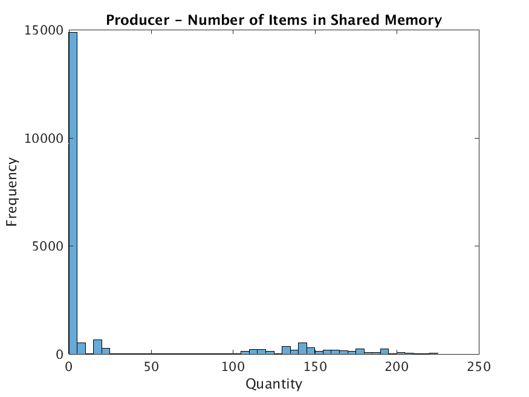

#Program 1 – Semaphores and Concurrency using Processes

##Problem Statement
 The assignment was to write a producer/consumer program using processes. The producer generates or produces some data and the consumer uses it. We can to add functionality to keep track of how many items were in the buffer at any given point, the time it took for the producer to add an item, and the time it took for the consumer to remove one. We were then supposed to use the data collected to study the concurrency mechanisms of the operating system. This process was supposed to give us an insight into what the operating system was doing on the program's behalf.

##Approach
 The operating system I am using is Debian Linux. I used the ANSI C programming language for my design. My design consists of using semaphores for assuring mutual exclusion, shared memory segment to share a buffer between the producer/consumer pair, and forking as a mechanism of creating two processes. The program uses this shared memory segment as an array and a semaphore to keep track of how many items are in the buffer at a given point. The program generates a random number to simulate the process of producing for the producer and it does a division operation to simulate the consuming for the consumer. I programmed the buffer to much longer than the program would ever use (about 80,000 items long). I then programmed the producer to stop after inserting 20,000 items.

##Solution
 The build environment just consists of a Makefile. To compile from source, _make_ and _gcc_ are required. Building is simple: change into the directory and run the command "_make_". Once the program compiles. It can either be run using the pgm1 file that was compiled or for simplicity, just "_make run_" to run the program with default command line arguments. This stores the output data in files inside the out directory. After this I imported the files into MATLAB and ran the histogram() function to generate the histograms in this report. The following picture shows and example build and execution of the program.
 

##Analysis of Histograms
 Since the producer was programmed to stop producing after 20,000 items, looking at both the histograms for "Number of items in shared memory" tells us that the operating system was very efficiently switching between the two processes. This is indicated by the fact that about 15,000 of the 20,000 values were in the range of 0 to 10. This means that as soon as the producer inserted the data in the buffer, the consumer process consumed it.
 The histograms for the "time taken" are much more interesting to analyze. Both the plots look almost identical and skewed towards the left. This measured time also includes the time during which either of the processes were waiting on a semaphore. Since the operating system was doing its job so well, both the times are skew towards the low end of the spectrum. If they were skewed towards the right, that would indicate that the processes were waiting on the semaphores for a long time.

